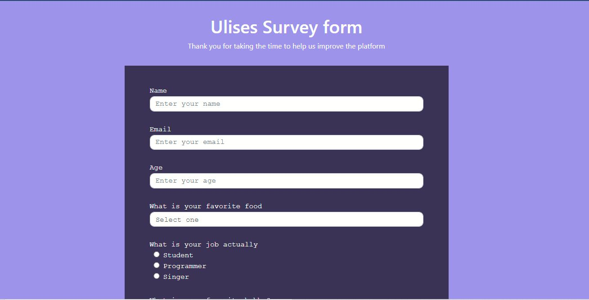

# freeCodeCamp

Responsive Web Design Certification (300 hours)

Certificado: https://www.freecodecamp.org/certification/UlisesJuarez/responsive-web-design

---

## Build a tribute page

You can see the project on this link: https://codepen.io/ulisesjuarez/full/abVeoRz

---

## Build a survey form

You can see the project on this link: https://codepen.io/ulisesjuarez/full/qBVzzKP

---

## Build a product landing page

You can see the project on this link: https://codepen.io/ulisesjuarez/full/YzEmpwP

## Build a technical documentation page

You can see the project on this link: https://codepen.io/ulisesjuarez/full/KKZPKLK

